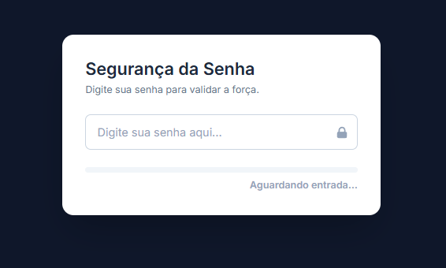

# 🔐 Password Strength Validator

> Validador de Força de Senha com If/Else
onde foi criado um campo de senha com indicador visual de força usando estruturas condicionais.


## 📸 Preview




## 🎯 Sobre o Projeto

Este projeto foi desenvolvido como um desafio técnico focado na criação de micro-interações de front-end.

A aplicação avalia a entrada do usuário em tempo real e fornece feedback visual e textual imediato, utilizando uma arquitetura baseada em eventos.

## 🚀 Tecnologias & Ferramentas

* **HTML5 Semântico:** 
* **Tailwind CSS (via CDN):** Para estilização rápida e utilitária.
* **JavaScript (ES6+):** Lógica de manipulação do DOM e eventos, utilizando conceitos modernos como `defer` para carregamento não-bloqueante.

## ✨ Funcionalidades

* ✅ **Validação Reativa:** Feedback instantâneo através do evento `input`.
* ✅ **Indicador Visual:** Barra de progresso com transições suaves (CSS transitions) e código de cores semáforico.
* ✅ **Acessibilidade (a11y):**
    * Uso de `aria-live="polite"` para leitores de tela anunciarem a mudança de status sem interromper a digitação.
    * Inputs devidamente rotulados com `sr-only`.
* ✅ **Estado "Empty":** Tratamento específico para quando o campo é limpo, resetando a interface para o estado inicial.


## 🚀 Como executar

Basta clonar o repositório e abrir o arquivo `index.html` no seu navegador.

```bash
# Clone este repositório
$ git clone https://github.com/Alicia-Alexia/validador_senha.git

# Acesse a pasta do projeto no terminal/cmd
$ cd validador_senha
# Abra o index.html no navegador
```

## 📂 Estrutura de Arquivos

A estrutura foi pensada para projetos estáticos, mantendo a raiz limpa e os recursos organizados:

/validador_senha

    │
    ├── assets/              <-- Pasta principal de recursos
    │   ├── js/              <-- Pasta específica para Scripts
    │   │   └── script.js
    │   │
    │   │
    │   └── img/ 
    |        └── image.png     
    │
    ├── index.html           
    └── README.md         <-- Documentação


## 🤝 Autor
Desenvolvido por Alicia como parte de estudos em Frontend Development.